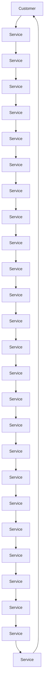

# copdemo

# create mermaid diagram based on customer service 

```mermaid
graph TD
    A[Customer] --> B[Service]
    B --> C[Service]
    C --> D[Service]
    D --> E[Service]
    E --> F[Service]
    F --> G[Service]
    G --> H[Service]
    H --> I[Service]
    I --> J[Service]
    J --> K[Service]
    K --> L[Service]
    L --> M[Service]
    M --> N[Service]
    N --> O[Service]
    O --> P[Service]
    P --> Q[Service]
    Q --> R[Service]
    R --> S[Service]
    S --> T[Service]
    T --> U[Service]
    U --> V[Service]
    V --> W[Service]
    W --> X[Service]
    X --> Y[Service]
    Y --> Z[Service]
    Z --> A
```

